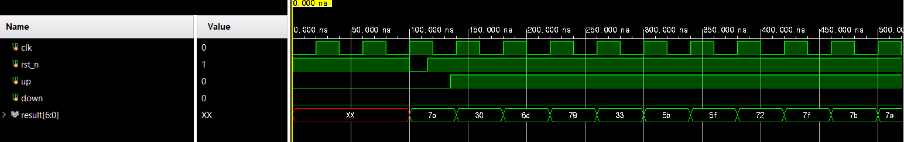
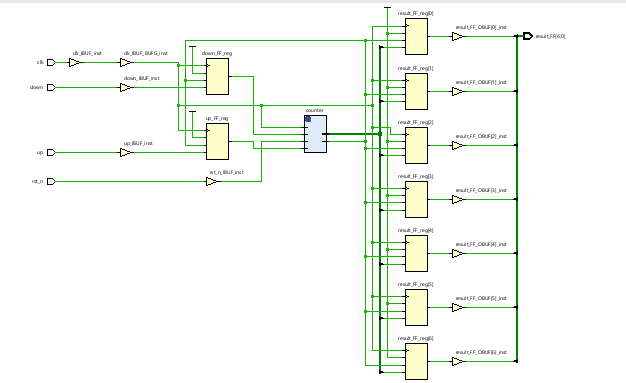
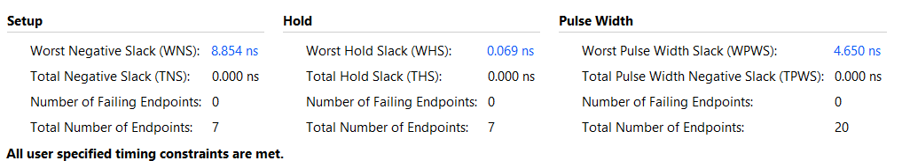
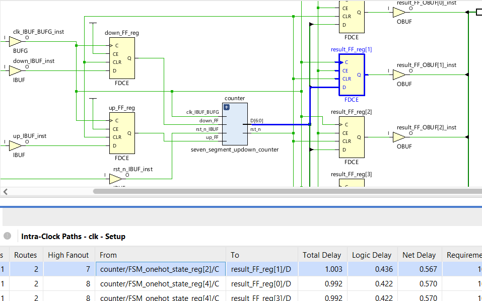
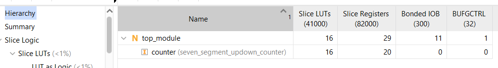
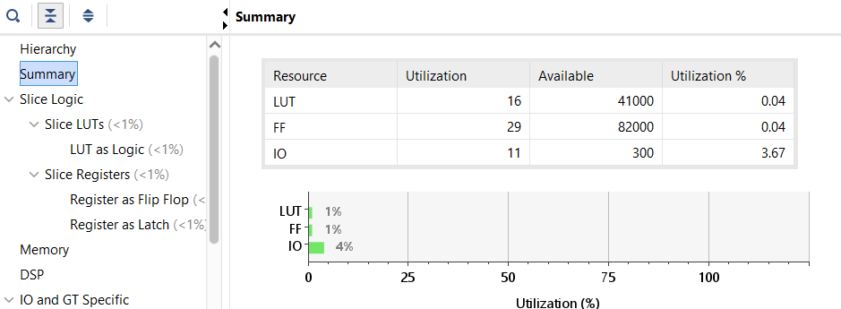

# 12주차 실습보고서

## 7-segment Up-Down Counter

### Verilog

```verilog
module seven_segment_updown_counter
    #(
        parameter [3: 0]
        S0 = 4'd0,
        S1 = 4'd1,
        S2 = 4'd2,
        S3 = 4'd3,
        S4 = 4'd4,
        S5 = 4'd5,
        S6 = 4'd6,
        S7 = 4'd7,
        S8 = 4'd8,
        S9 = 4'd9
    )
    (
        input clk, rst_n, up, down,
        output [6: 0] result
    );
    
    reg [3: 0] state, next_state;
    wire A, B, C, D, E, F, G;
    
    always @(posedge clk, negedge rst_n) begin:update_state
        if(!rst_n) state <= S0;
        else       state <= next_state;
    end
    
    always @(*) begin:update_next_state
        case(state)
        // 매 상태마다 up 혹은 down을 보고 상태 변화
        S0:
            if(up == 1 && down == 0)        next_state = S1;
            else if(up == 0 && down == 1)   next_state = S9;
            else                            next_state = S0;
        S1:
            if(up == 1 && down == 0)        next_state = S2;
            else if(up == 0 && down == 1)   next_state = S0;
            else                            next_state = S1;
        S2:
            if(up == 1 && down == 0)        next_state = S3;
            else if(up == 0 && down == 1)   next_state = S1;
            else                            next_state = S2;
        S3:
            if(up == 1 && down == 0)        next_state = S4;
            else if(up == 0 && down == 1)   next_state = S2;
            else                            next_state = S3;
        S4:
            if(up == 1 && down == 0)        next_state = S5;
            else if(up == 0 && down == 1)   next_state = S3;
            else                            next_state = S4;
        S5:
            if(up == 1 && down == 0)        next_state = S6;
            else if(up == 0 && down == 1)   next_state = S4;
            else                            next_state = S5;
        S6:
            if(up == 1 && down == 0)        next_state = S7;
            else if(up == 0 && down == 1)   next_state = S5;
            else                            next_state = S6;
        S7:
            if(up == 1 && down == 0)        next_state = S8;
            else if(up == 0 && down == 1)   next_state = S6;
            else                            next_state = S7;
        S8:
            if(up == 1 && down == 0)        next_state = S9;
            else if(up == 0 && down == 1)   next_state = S7;
            else                            next_state = S8;
        S9:
            if(up == 1 && down == 0)        next_state = S0;
            else if(up == 0 && down == 1)   next_state = S8;
            else                            next_state = S9;
        endcase
    end
    
    // 상태에 따른 combinatioinal logic
    assign A = (state != S1) && (state != S4);
    assign B = (state != S5) && (state != S6);
    assign C = (state != S2);
    assign D = (state != S1) && (state != S4) && (state != S7);
    assign E = (state == S0) || (state == S2) || (state == S6) || (state == S8);
    assign F = (state != S1) && (state != S2) && (state != S3);
    assign G = (state != S0) && (state != S1) && (state != S7);
    
    assign result = {A, B, C, D, E, F, G};
endmodule
```

### TestBench

```verilog
module tb_seven_segment_updown_counter;
    reg clk, rst_n, up, down;
    wire [6: 0] result;
    
    seven_segment_updown_counter UUT(clk, rst_n, up, down, result);
    
    initial begin
        clk = 0;
        rst_n = 1;
        up = 0;
        down = 0;
        
        #100 rst_n = 0;
        #15 rst_n = 1;
        
        #20 up = 1; down = 0;
        #400 up = 0; down = 1;
        #400 up = 0; down = 0;
        
        #100 $finish;
    end
    
    always #20 clk = ~clk;
endmodule
```

### Simulation



### Synthesis & Analysis

top module

```verilog
module top_module(
        input clk, rst_n, up, down,
        output reg  [6: 0] result_FF
    );
    
    reg up_FF, down_FF;
    wire [6: 0] result;
    
    always @(posedge clk, negedge rst_n) begin
        if(!rst_n) begin
            up_FF <= 0;
            down_FF <= 0;
        end
        
        else begin
            up_FF <= up;
            down_FF <= down;
        end
    end
    
    seven_segment_updown_counter counter(
        .clk(clk),
        .rst_n(rst_n),
        .up(up_FF),
        .down(down_FF),
        .result(result)
    );
    
    always @(posedge clk, negedge rst_n) begin
        if(!rst_n)
            result_FF <= 0;
        else
            result_FF <= result;
    end
endmodule
```

constraints
```verilog
create_clock -period 10.000 -name clk -waveform {0.000 5.000} [get_ports clk]
```

schematic


time report


critical path delay


report utilization

hierarchy


summary


### 결과 분석 및 고찰

state machine으로 7-segment updown counter를 구현하였다.
또한 report를 통해 critical path의 형성을 보았다.

결과를 분석하는 법과 timing 제약조건을 추가하는 법을 알게 되었다.