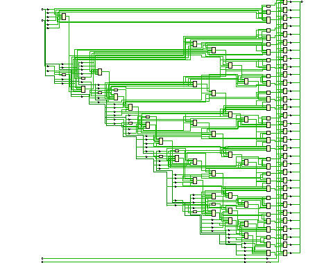
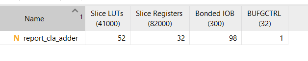
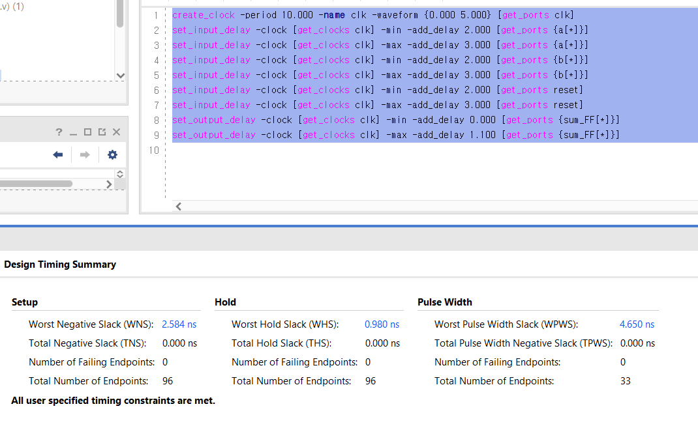
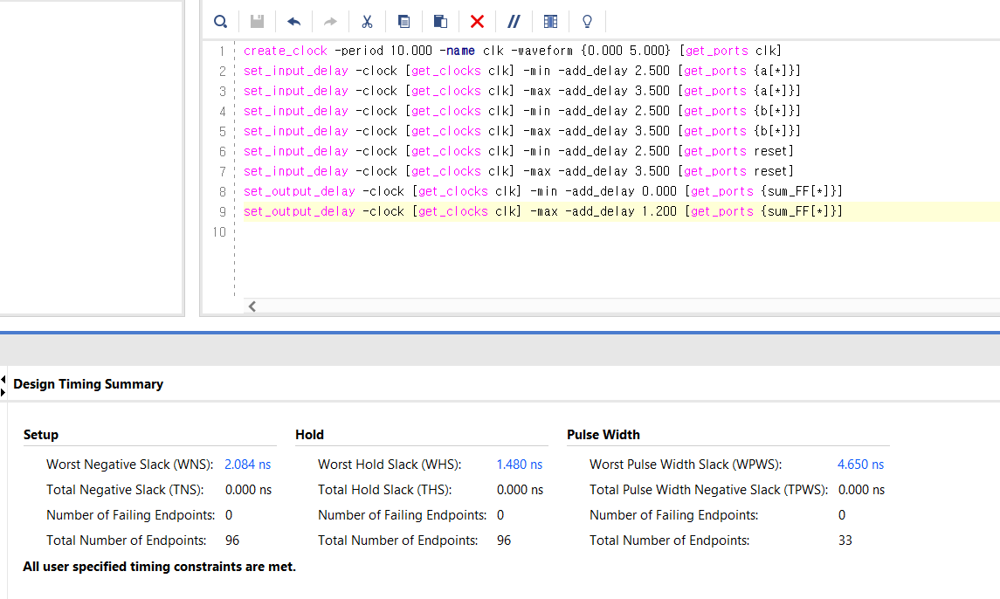
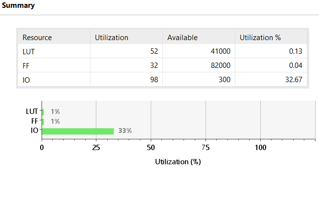

# 13주차 실습보고서

## 1. 4-bit, 32-bit CLA 구현

## Verilog

```verilog
module cla_adder
    #(
        parameter N = 4
    )
    (
        input [N - 1: 0] x,
        input [N - 1: 0] y,
        input cin,
        output [N - 1: 0] sum,
        output cout  
    );
    
    wire [N - 1: 0] p, g;
    wire [N: 0] c;
    
    assign c[0] = cin;
    
    genvar i;
    generate for (i = 0; i < N; i = i + 1) begin: pq_cla
        assign p[i] = x[i] ^ y[i];
        assign g[i] = x[i] & y[i];
    end
    endgenerate
    
    generate for (i = 1; i < N + 1; i = i + 1) begin: carry_cla
        assign c[i] = g[i - 1] | (p[i - 1] & c[i - 1]);
    end
    endgenerate
    
    generate for (i = 0; i < N; i = i + 1) begin: sum_cla
        assign sum[i] = p[i] ^ c[i];
    end
    endgenerate
    
    assign cout = c[N];
endmodule
```


constraints
```
create_clock -period 10.000 -name clk -waveform {0.000 5.000} [get_ports clk]
set_input_delay -clock [get_clocks clk] -min -add_delay 2.000 [get_ports {a[*]}]
set_input_delay -clock [get_clocks clk] -max -add_delay 3.000 [get_ports {a[*]}]
set_input_delay -clock [get_clocks clk] -min -add_delay 2.000 [get_ports {b[*]}]
set_input_delay -clock [get_clocks clk] -max -add_delay 3.000 [get_ports {b[*]}]
set_input_delay -clock [get_clocks clk] -min -add_delay 2.000 [get_ports reset]
set_input_delay -clock [get_clocks clk] -max -add_delay 3.000 [get_ports reset]
set_output_delay -clock [get_clocks clk] -min -add_delay 0.000 [get_ports {sum_FF[*]}]
set_output_delay -clock [get_clocks clk] -max -add_delay 1.100 [get_ports {sum_FF[*]}]
```

## Schematic



## Report



timing constraints를 수정한 결과

WNS가 줄어들어 critical path delay가 증가함을 알 수 있다.


## 고찰

report를 통해 critical path delay를 계산하는 법과 여러 정보를 파악할 수 있었다.