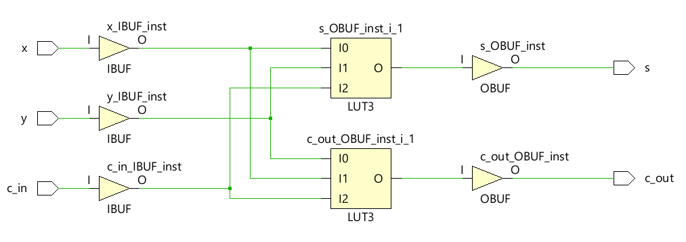

# 2주차 실습 보고서

## 실습과제 1: 1-Bit Full Adder


### VHDL 코드
```v
module full_adder(
    x, y, c_in, s, c_out
    );
    input x, y, c_in;
    output s, c_out;
    
    wire s1, c1, c2;
    
    xor xor_half(s1, x, y);
    and and_half(c1, x, y);
    
    xor xor_half2(s, c_in, s1);
    and and_half2(c2, c_in, s1);
    
    or or_carry(c_out, c1, c2);
    
endmodule
```

### TestBench 코드
```v
module tb_full_adder;
    reg x, y, c_in;
    wire c_out, s;
    
    full_adder tb(
        .x(x),
        .y(y),
        .c_in(c_in),
        .c_out(c_out),
        .s(s)
    );
    
    initial begin
        {x, y, c_in} = 3'b000;
        
        #10 {x, y, c_in} = 3'b001;
        #10 {x, y, c_in} = 3'b010;
        #10 {x, y, c_in} = 3'b011;
        #10 {x, y, c_in} = 3'b100;
        #10 {x, y, c_in} = 3'b101;
        #10 {x, y, c_in} = 3'b110;
        #10 {x, y, c_in} = 3'b111;
    end
    
endmodule
```

### Schematic


### 결과값 및 파형


### 분석 및 고찰

1-Bit Full Adder는
3개의 input x, y, c_in을 받아
세 값을 더하고 {c_out, s}에 저장한다.

파형을 보면 1이 2개 이상일 때 s = 1이고
1이 1개, 3개일 때 c_out = 1이 되는 걸 관찰할 수 있다.

## 실습과제 2: 8-to-1 MUX


### VHDL 코드

```v
module mux_8_to_1(
    s, i, out
    );
    input [2: 0] s;
    input [8: 0] i;
    output out;
    
    wire [8: 0] v;
    wire [2: 0] ns;
    
    not not_0(ns[0], s[0]);
    not not_1(ns[1], s[1]);
    not not_2(ns[2], s[2]);
    
    and and_0(v[0], i[0], ns[2], ns[1], ns[0]);
    and and_1(v[1], i[1], ns[2], ns[1], s[0]);
    and and_2(v[2], i[2], ns[2], s[1], ns[0]);
    and and_3(v[3], i[3], ns[2], s[1], s[0]);
    and and_4(v[4], i[4], s[2], ns[1], ns[0]);
    and and_5(v[5], i[5], s[2], ns[1], s[0]);
    and and_6(v[6], i[6], s[2], s[1], ns[0]);
    and and_7(v[7], i[7], s[2], s[1], s[0]);
    
    or or_out(out, v[0], v[1], v[2], v[3], v[4], v[5], v[6], v[7]);
endmodule
```

### TestBench 코드

```v
module tb_mux_8_to_1;
    reg [8: 0] i;
    reg [2: 0] s;
    wire out;
    
    mux_8_to_1 tb(
        .i(i),
        .s(s),
        .out(out)
        );
    
    initial begin
    i = 8'b01010101;
    s = 3'b000;
    
    #10 s = 3'b001;
    #10 s = 3'b010;
    #10 s = 3'b011;
    #10 s = 3'b100;
    #10 s = 3'b101;
    #10 s = 3'b110;
    #10 s = 3'b111;
    #10 s = 3'b000;
    
    end
endmodule
```

### Schematic


### 결과값 및 파형


### 분석 및 고찰

8to1 Mux는 8bit input을 3bit selection bit값에 따라 1bit output으로 연결한다.

input 값이 짝수비트마다 1로 설정하였는데,
파형을 보면 3bit s 값이 짝수일 때마다 1이 되는 것을 알 수 있다.

Schematic을 보면 LUT라는 게이트가 사용되는데 Look Up Table이라고 한다.
흔히 공부했던 진리표가 그대로 구현된 것이다.
