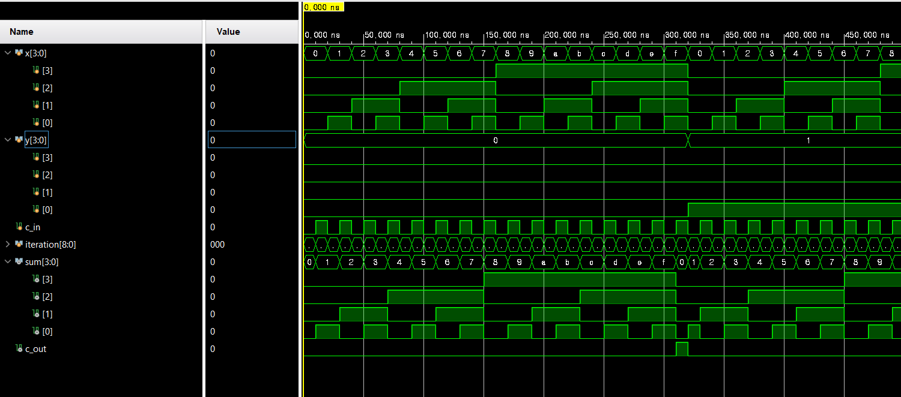

# 3주차 실습 보고서

## 실습과제 1: 4-Bit Adder


### VHDL 코드
1. 1-bit half_adder
```verilog
module half_adder(
        x, y, s, c
    );
    
    input x, y;
    output s, c;
    
    xor xor_s(s, x, y);
    and and_c(c, x, y);
    
endmodule
```
2. 1-bit full adder
```verilog
module full_adder(
        x, y, cin, s, cout
    );
    input x, y, cin;
    output s, cout;
    
    wire s1, c1, c2;
    
    half_adder ha_1(x, y, s1, c1);
    half_adder ha_2(cin, s1, s, c2);
    or (cout, c1, c2);
    
endmodule
```
3. 4-bit adder
```verilog
module _4_bit_adder(
        x, y, c_in, sum, c_out
    );
    
    input [3: 0] x, y;
    input c_in;
    output [3: 0] sum;
    output c_out;
    
    wire [2: 0] c;
    
    full_adder fa_0(x[0], y[0], c_in, sum[0], c[0]);
    full_adder fa_1(x[1], y[1], c[0], sum[1], c[1]);
    full_adder fa_2(x[2], y[2], c[1], sum[2], c[2]);
    full_adder fa_3(x[3], y[3], c[2], sum[3], c_out);
    
endmodule
```

### TestBench 코드
```verilog
module tb_4_bit_adder;

    reg [3: 0] x, y;
    reg c_in;
    reg [8: 0] iteration;
    
    wire [3: 0] sum;
    wire c_out;
    
    _4_bit_adder tb(
        .x(x),
        .y(y),
        .c_in(c_in),
        .sum(sum),
        .c_out(c_out)
    );
    
    initial begin
        x = 0;
        y = 0;
        c_in = 0;
        iteration = 0;
    end
    
    always #10 begin
        iteration = iteration + 1;
        x = (9'hff & (iteration >> 1));
        y = (9'hff & (iteration >> 5)) ;
        c_in = 9'b1 & iteration;
    end
               
endmodule
```

### Schematic


### 결과값 및 파형



### 분석 및 고찰

4-bit adder는 4개의 1-bit full adder를 연결하여 구성한다.
각각의 full adder의 c_out이 다음 full adder의 c_in이 된다.

파형을 보면 총합이 0부터 1FF까지 진행해나가는 모습을 볼 수 있다.

## 실습과제 2: 9bit parity generator


### VHDL 코드

1. 4-bit xor
```verilog
module bit4_xor(o, x);
    input [3: 0] x;
    wire [1: 0] t;
    output o;
    
    xor xor_1(t[0], x[0], x[1]);
    xor xor_2(t[1], x[2], x[3]);
    
    xor xor_o(o, t[0], t[1]);
endmodule
```

2. 8-bit xor
```verilog
module bit8_xor(o, x);
    input [7: 0] x;
    wire [1: 0] t;
    output o;

    bit4_xor xor_1(t[0], x[3: 0]);
    bit4_xor xor_2(t[1], x[7: 4]);
    
    xor xor_o(o, t[0], t[1]);
endmodule
```

3. 9-bit parity generator
```verilog
module bit9_parity_generator(
        e, o, x
    );
    input [8: 0] x;
    wire t;
    output o;
    output e;
    
    bit8_xor xor_0(t, x[7: 0]);
    xor xor_e(e, t, x[8]);
    not not_o(o, e);
    
endmodule
```

### TestBench 코드

```verilog
module tb_bit9_parity_generator;
    reg [8: 0] x;
    wire e, o;
    
    bit9_parity_generator tb(.e(e), .o(o), .x(x));
    
    initial begin
        x = 9'd0;
    end

    always begin
        #10 x = x + 1;
    end

endmodule
```

### Schematic


### 결과값 및 파형


### 분석 및 고찰

9-bit parity generator는 주어진 9bit 입력에 대해서
값이 1인 bit의 개수를 세어 짝수개이면 (even, odd) = (1, 0)
홀수개이면 (even, odd) = (0, 1)을 출력하는 회로이다.
출력 파형을 보면 x의 각 비트 중 1의 개수에 맞춰 e와 o가 변하는 모습을 볼 수 있다.