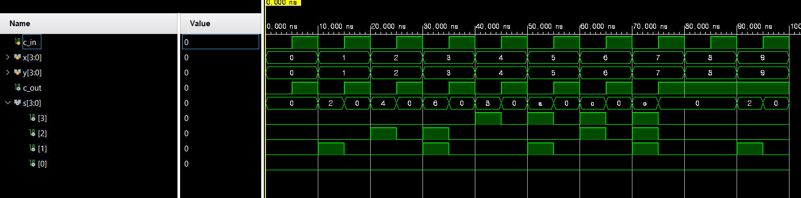

# 4주차 실습 보고서

## 실습과제 1: 8 to 1 Mux


### VHDL 코드

```verilog
module mux_8_to_1(
        o, s, i
    );
    
    input [7: 0] i;
    input [2: 0] s;
    output o;
    
    assign o = 
                (s == 3'b000 & i[0]) |
                (s == 3'b001 & i[1]) |
                (s == 3'b010 & i[2]) |
                (s == 3'b011 & i[3]) |
                (s == 3'b100 & i[4]) |
                (s == 3'b101 & i[5]) |
                (s == 3'b110 & i[6]) |
                (s == 3'b111 & i[7]);
endmodule
```

### TestBench 코드
```verilog
module tb_mux_8_to_1;
    reg [7: 0] i;
    reg [2: 0] s;
    wire o;
    
    mux_8_to_1 tb(.o(o), .s(s), .i(i));
    
    initial begin
        s = 3'b000; i = 8'b1;
    #20 s = 3'b001; i = 8'b10;
    #20 s = 3'b010; i = 8'b100;
    #20 s = 3'b011; i = 8'b1000;
    #20 s = 3'b100; i = 8'b10000;
    #20 s = 3'b101; i = 8'b100000;
    #20 s = 3'b110; i = 8'b1000000;
    #20 s = 3'b111; i = 8'b10000000;
    end
endmodule
```

### Schematic


### 결과값 및 파형


### 분석 및 고찰
DataFlow 모델링으로 8-1 mux를 구현하였다.
이전의 Structural 모델링에 비해 조금 더 직관적으로 코드를 작성할 수 있다고 느꼈다.

## 실습과제 2: 4 bit adder


### VHDL 코드

```verilog
module adder_4_bit(s, c_out, x, y, c_in);
    input [3: 0] x, y;
    input c_in;
    output [3: 0] s;
    output c_out;
    
    assign {c_out, s} = x + y + c_in;
endmodule
```

### TestBench 코드

```verilog
module tb_adder_4_bit;
    reg c_in;
    reg [3: 0] x, y;
    wire c_out;
    wire [3: 0] s;
    
    adder_4_bit tb(.c_in(c_in), .x(x), .y(y), .c_out(c_out), .s(s));
    
    initial begin
        c_in = 1'b0;
        x = 4'b0;
        y = 4'b0;
    end
    
    always begin
        #10 x = x + 1; y = y + 1;
    end
    
    initial #100 $finish;
endmodule
```

### Schematic


### 결과값 및 파형


### 분석 및 고찰

4 bit adder를 dataflow로 구현하였다.
아주 간단한 코드만으로도 adder를 구현할 수 있어 좋았다.
결과값을 보면 overflow가 발생하면 cout이 커지는 것을 볼 수 있다.

## 실습과제 3: 4 bit 2's complement adder


## VHDL 코드

```verilog
module complement_adder_4_bit(
        s, c_out, x, y, c_in
    );
    
    input [3: 0] x, y;
    input c_in;
    
    output [3: 0] s;
    output c_out;
    
    assign {c_out, s} = x + c_in + (y ^ {4{c_in}});
endmodule
```

## TestBench 코드

```verilog
module tb_adder_4_bit;
    reg c_in;
    reg [3: 0] x, y;
    wire c_out;
    wire [3: 0] s;
    
//    adder_4_bit tb(.c_in(c_in), .x(x), .y(y), .c_out(c_out), .s(s));
    complement_adder_4_bit tb2(.c_in(c_in), .x(x), .y(y), .c_out(c_out), .s(s));
    initial begin
        c_in = 1'b0;
        x = 4'b0;
        y = 4'b0;
    end
    
    always #10 x = x + 1;
    always #10 y = y + 1;
    always #5 c_in = ~c_in;
    
    initial #100 $finish;
endmodule
```

## Schematic


## 결과값 및 파형



## 분석 및 고찰

4bit complentary adder는 c_in이 0일 경우 덧셈, 1일 경우 뺄셈을 수행한다.
input이 4bit이기 때문에 결과값 0이 제대로 나오지 않는 모습을 볼 수 있다.