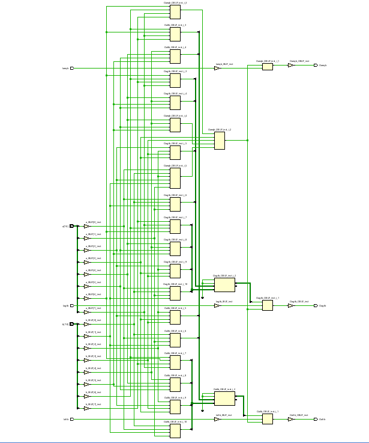
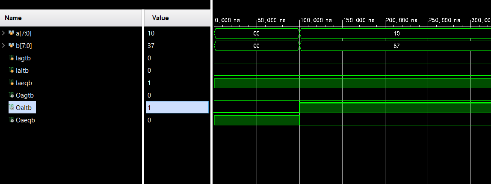
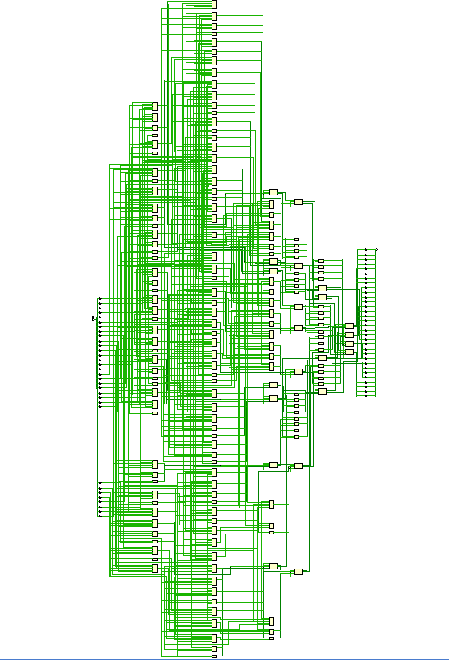
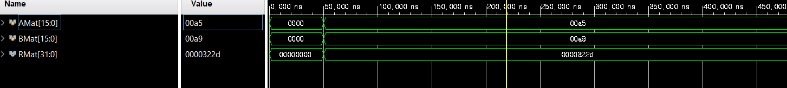
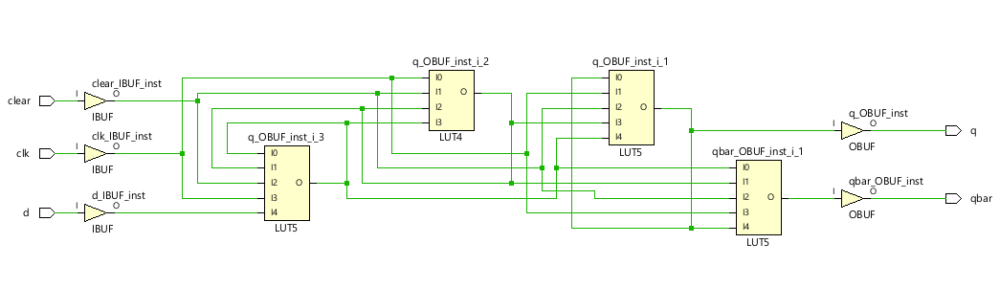
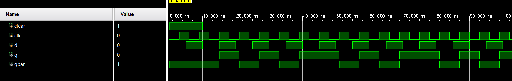

# 5주차 실습 보고서

## 실습과제 1: 8 bit cascade comparator


### VHDL 코드

```verilog
module comparator_cascade(
        Iaeqb,
        Iagtb,
        Ialtb,
        a, b,
        Oaeqb,
        Oagtb,
        Oaltb
    );
    parameter N = 8;
    
    input Iaeqb, Iagtb, Ialtb;
    input [N - 1: 0] a, b;
    output Oaeqb, Oagtb, Oaltb;
    
    assign Oaeqb = (a == b) && Iaeqb;
    assign Oagtb = (a > b) || ((a == b) && Iagtb);
    assign Oaltb = (a < b) || ((a == b) && Ialtb);
endmodule
```

### TestBench 코드
```verilog
module tb_comparator_cascade(

    );
    
    reg [7: 0] a, b;
    reg Iagtb, Ialtb, Iaeqb;
    wire Oagtb, Oaltb, Oaeqb;
    
    comparator_cascade tb(.Iaeqb(Iaeqb), .Iagtb(Iagtb), .Ialtb(Ialtb),
                        .a(a), .b(b), .Oaeqb(Oaeqb), .Oagtb(Oagtb), .Oaltb(Oaltb));
                        
                        
                        
   initial begin
   a = 0; b= 0; Iagtb= 1'b0; Iaeqb=1'b1; Ialtb=1'b0;
   #100 a = 8'd16; b = 8'd55;
   end                 
endmodule
```

### Schematic


### 결과값 및 파형


### 분석 및 고찰
DataFlow 모델링으로 cacade comparator를 구현했다.
parameter를 쓸 수 있음을 알게 되었다.

## 실습과제 2: Matrix Multiplication


### VHDL 코드

```verilog
module matrix_multiplication(
    A, B, R
    );
    parameter N = 4;
    input [N ** 2 - 1: 0] A, B;
    output [2 * (N ** 2) - 1: 0] R;
    
    wire [3: 0] AMat[0: 1][0: 1];
    wire [3: 0] BMat[0: 1][0: 1];
    wire [7: 0] RMat[0: 1][0: 1];
    
    assign AMat[0][0] = A[3: 0];
    assign AMat[0][1] = A[7: 4];
    assign AMat[1][0] = A[11: 8];
    assign AMat[1][1] = A[15: 12];
    
    assign BMat[0][0] = B[3: 0];
    assign BMat[0][1] = B[7: 4];
    assign BMat[1][0] = B[11: 8];
    assign BMat[1][1] = B[15: 12];
    
    assign RMat[0][0] = (AMat[0][0] * BMat[0][0] + AMat[0][1] * BMat[1][0]);
    assign RMat[0][1] = (AMat[0][0] * BMat[0][1] + AMat[0][1] * BMat[1][1]);
    assign RMat[1][0] = (AMat[1][0] * BMat[0][0] + AMat[1][1] * BMat[1][1]);
    assign RMat[1][1] = (AMat[1][0] * BMat[0][1] + AMat[1][1] * BMat[1][1]);
    
    assign R = { RMat[1][1], RMat[1][0], RMat[0][1], RMat[0][0]};
endmodule

```

### TestBench 코드

```verilog
module tb_matrix_multiplication(

    );
    
    
    
    reg [15: 0] AMat;
    reg [15: 0] BMat;
    wire [31: 0] RMat;
    
    matrix_multiplication tb(.A(AMat), .B(BMat), .R(RMat));
    
    initial begin
    AMat = 0; BMat = 0;
    #50 AMat = 16'ha5; BMat = 16'ha9;
    end
    
endmodule

```

### Schematic



### 결과값 및 파형



### 분석 및 고찰

matrix multiplication은 구현이 복잡하였다.
그러나, 특히 근래 인공지능 등으로 행렬 연산이 중요해진 상황에서
회로를 통해 어떻게 구현하는지 대략적으로 알 수 있었다.

## 실습과제 3: positive edge d-ff

## VHDL 코드

```verilog

module d_ff_pos_edge(
        clear, clk, d, q, qbar
    );
    
    input clear, clk, d;
    output q, qbar;
    
    wire cbar, s, sbar, r, rbar;
    
    assign cbar = ~clear;
    
    assign s = ~(clk && sbar && cbar);
    assign sbar = ~(s && rbar);
    
    assign r = ~(clk && rbar && s);
    assign rbar = ~(r && cbar && d);
    
    assign q = ~(qbar && s);
    assign qbar = ~(q && r && cbar);
endmodule

```

## TestBench 코드

```verilog
module tb_d_ff_pos_edge;
     reg clear, clk, d;
     wire q, qbar;
     
     d_ff_pos_edge tb(.clear(clear), .clk(clk), .d(d), .q(q), .qbar(qbar));
     
     initial begin
     clk = 0; clear = 1; d = 0;
     #10 clear = 0;
     end
     always begin
        #3 clk = ~clk;
     end
     always begin
        #5 d = ~d;
     end
     
endmodule

```

## Schematic



## 결과값 및 파형



## 분석 및 고찰

data flow 방식으로 d-ff을 구현했다.
회로가 비선형적으로 구성되어 그 동작을 머리 속으로 추적하기가 매우 어려웠다.