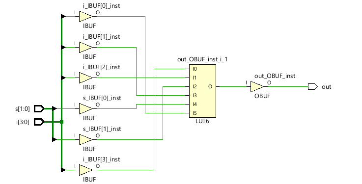
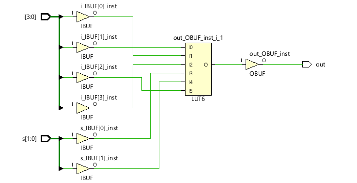
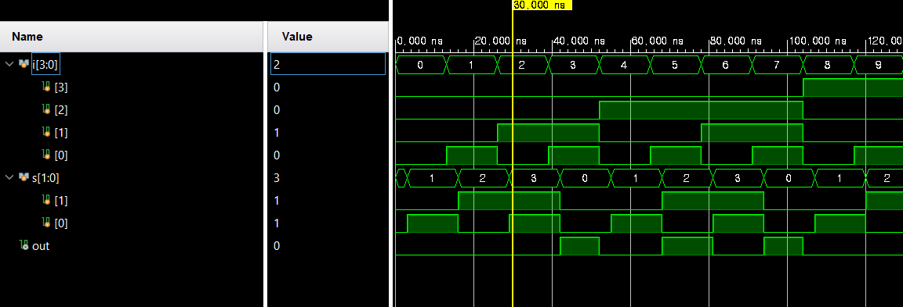
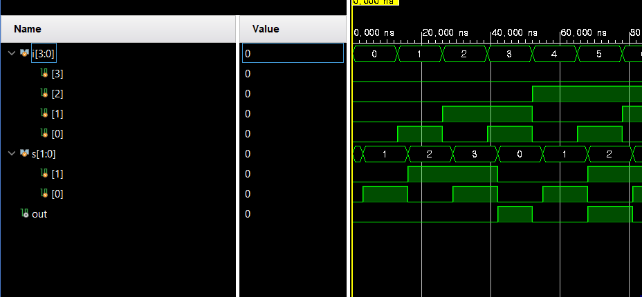
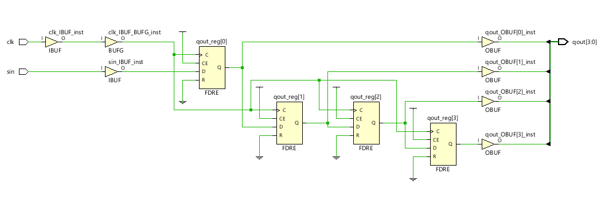
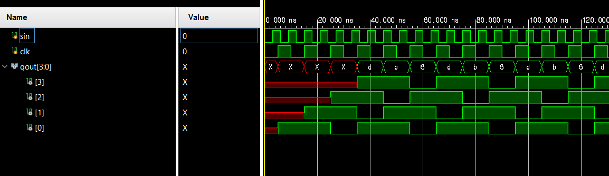
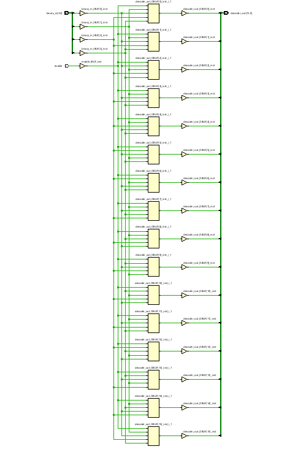
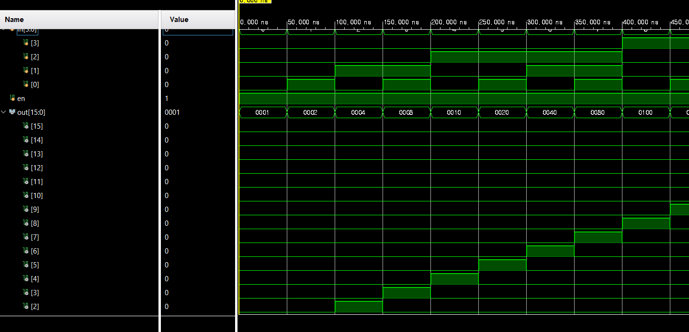

# 5주차 실습 보고서

## 실습과제 1, 2: 4-to-1 MUX (if~ else~), (case)


### VHDL 코드

1. if~ else~
```verilog
module mux_4_to_1_if_else(
    i, s, out
);
    input [3: 0] i;
    input [1: 0] s;
    output reg out;

    always @(*) begin
        if(s1) begin
            if(s0) out = i3; else out = i2;
        end
        else begin
            if(s0) out = i1; else out = i0;
        end
    end
endmodule
```

2. case
```verilog
module mux_4_to_1(
    i, s, out
    );
    input [3: 0] i;
    input [1: 0] s;
    output reg out;
    
    always @(*) begin
        case (s)
            2'b00: out = i[0];
            2'b01: out = i[1];
            2'b10: out = i[2];
            default: out = i[3];
            // default == 2'b11
        endcase
    end
endmodule
```

### TestBench 코드

```verilog
module tb_mux_4_to_1;
    reg [3: 0] i;
    reg [1: 0] s;
    wire out;
    
    mux_4_to_1 tb(.i(i), .s(s), .out(out));
    mux_4_to_1_if_else tb2(.i(i), .s(s), .out(out));
    
    initial begin
    i = 4'b0;
    s = 2'b0;    
    end
    
    always begin
        #3 s <= s + 1;
        #10 i <= i + 1;
    end
endmodule
```

### Schematic
1. if~ else~


2. case


### 결과값 및 파형
1. if~ else~


2. case


### 분석 및 고찰
if else와 case 문을 통해 behavioral modeling mux를 구현하였다.
이 경우 case 문이 비교적 동작을 추적하기 더 용이하다고 느껴졌는데,
적절한 사용을 통해 동작을 추적하기 쉽게 해야겠다.

## 실습과제 3: 4-bit shift-register

### VHDL 코드

```verilog
module shift_register_4_bit(
        clk, sin, qout
    );
    input clk, sin;
    output reg [3: 0] qout;
    
    always @(posedge clk) begin
        qout <= {qout[2: 0], sin};
    end
endmodule
```

### TestBench 코드

```verilog
module tb_shift_register_4_bit;

    reg sin, clk;
    wire [3: 0] qout;
    
    shift_register_4_bit tb(.sin(sin), .clk(clk), .qout(qout));
    
    initial begin
        sin = 0;
        clk = 0;
    end
    
    always begin
        #5 clk <= ~clk;
    end
    always #3 sin <= ~sin;
    
    
endmodule
```

### Schematic



### 결과값 및 파형



### 분석 및 고찰

shift register를 behavioral modeling을 통해 구현하였다.
특히 concatenation 연산을 통해 손쉽게 구현이 되었다.

## 실습과제 4: 4-to-16 decoder

## VHDL 코드

```verilog
module decoder(
    binary_in,
    decoder_out,
    enable
);
    parameter N = 4;

    input [N-1: 0] binary_in;
    input enable;
    output reg [N*N - 1: 0] decoder_out;
    integer  i;
    always @(enable or binary_in) begin
    for(i = 0; i < N * N; i = i + 1) begin
        if(enable) begin
            decoder_out[i] = (binary_in == i) ? 1'b1 : 1'b0;
        end
        else begin
            decoder_out[i] = 1'b0;
        end
    end
    end
endmodule
```

## TestBench 코드

```verilog
module tb_decoder_4_to_16;
    reg [3: 0] in;
    reg en;
    wire [15: 0] out;

    decoder d(
        .binary_in(in),
        .decoder_out(out),
        .enable(en)
    );

    initial begin
    in = 0; en = 1;

    forever begin
        #50 in = in + 1;
    end
    end

    initial #800 $finish;
endmodule
```

## Schematic



## 결과값 및 파형



## 분석 및 고찰

decoder를 구현하였다.
특히 for문의 이용을 통해 반복적인 코드를 줄이고
좀 더 효율적으로 모듈을 구현할 수 있단 점을 알게 되었다.