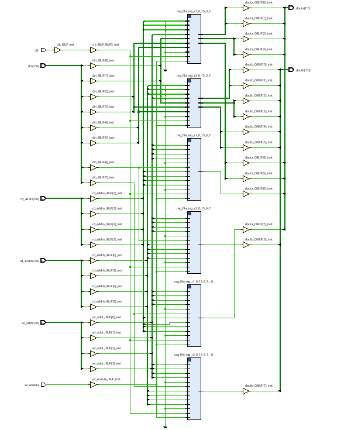
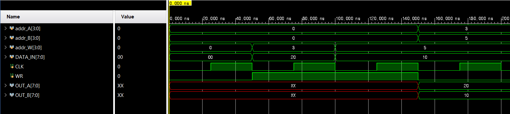
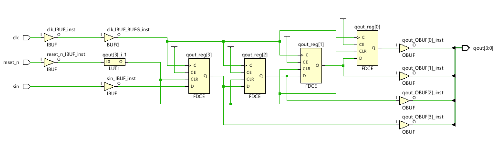
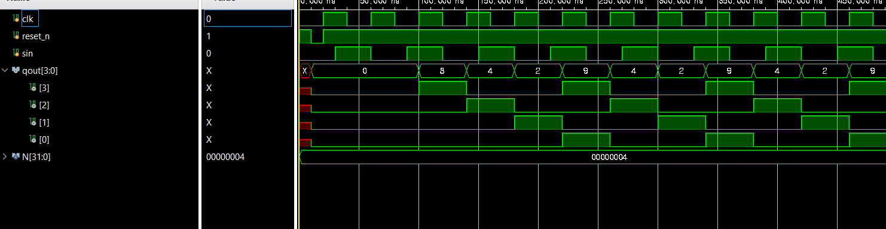
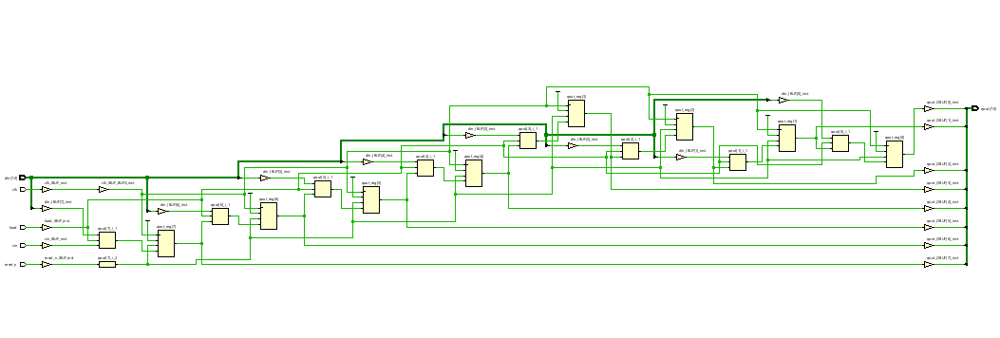
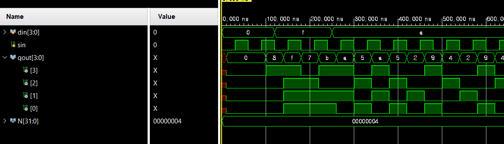

# 9주차 과제보고서

## 16-to-8 register file

### Verilog

```verilog
module register_file #(
        parameter M = 4,
        parameter N = 16,
        parameter W = 8   
    )
    (
        input clk,
        input wr_enable,
        input [W - 1: 0] din,
        input [M - 1: 0] rd_addra,
        input [M - 1: 0] rd_addrb,
        input [M - 1: 0] wr_addr,
        output[W - 1: 0] douta, 
        output [W - 1: 0] doutb
    );
    
    reg[W - 1: 0] reg_file[N - 1: 0];
    
    assign douta = reg_file[rd_addra];
    assign doutb = reg_file[rd_addrb];
    
    always @(posedge clk)
        if(wr_enable) reg_file[wr_addr] <= din;
        
endmodule
```

### TestBench

```verilog
module tb_register_file;
reg[3: 0] addr_A, addr_B, addr_W;
reg[7: 0] DATA_IN;
reg CLK, WR;

wire [7: 0] OUT_A, OUT_B;

register_file Regfile(
    .clk(CLK),
    .rd_addra(addr_A),
    .rd_addrb(addr_B),
    .wr_addr(addr_W),
    .wr_enable(WR),
    .din(DATA_IN),
    .douta(OUT_A),
    .doutb(OUT_B)
);

initial begin
CLK = 0; WR = 0; addr_A = 0; addr_B = 0; addr_W = 0; DATA_IN = 0;

#50 WR=1'b1; addr_W=4'd3; DATA_IN = 8'd32;
#50 WR=1'b1; addr_W=4'd5; DATA_IN = 8'd16;
#50 WR=1'b0; addr_A=4'd3; addr_B=4'd5;
end

always #25 CLK <= ~CLK;
endmodule
```

### Schematic



### Simulation



### 고찰

레지스터가 어떻게 만들어질지 생각해볼 수 있어서 좋았다.

## shift_register

### Verilog

```verilog
module shift_register
    #(
        parameter N = 4
    )
    (
        input clk,
        input reset_n,
        input sin,
        output reg [N - 1: 0] qout
    );

    always @(posedge clk or negedge reset_n)
        if(!reset_n) qout <= {N{1'b0}};
        else         qout <= {sin, qout[N - 1: 1]};
endmodule
```

### TestBench

```verilog
module tb_shift_register;
parameter N = 4;
reg  clk, reset_n;
reg  sin; // Serial input data
wire [N-1:0] qout;

shift_register #(4) uut(clk, reset_n, sin, qout);

always #20 clk = ~clk;
always #30 sin = ~sin;

initial begin
clk = 0; reset_n = 1; sin = 0;
#10 reset_n = 0;
#10 reset_n = 1;
end
endmodule
```

### Schematic



### Simulation



### 고찰

shift register를 쉽게 구현할 수 있어 신기했다.

## shift_register_parallel_load

### Verilog

```verilog
module shift_register_parallel_load
    #(
        parameter N = 8
    )
    (
        input clk,
        input load,
        input reset_n,
        input sin,
        input [N - 1: 0] din,
        output reg [N - 1: 0] qout
    );

    always @(posedge clk or negedge reset_n)
        if(!reset_n)  qout <= {N{1'b0}};
        else if(load) qout <= din;
        else          qout <= {sin, qout[N - 1: 1]};
endmodule
```

### TestBench

```verilog
module tb_shift_register_parallel_load;
parameter N = 4;
reg  clk, reset_n;
reg load;
reg  [N-1:0] din;
reg  sin;
wire [N-1:0] qout;

shift_register_parallel_load #(4)uut(clk, load, reset_n, din, sin, qout);

always #20 clk = ~clk;
always #30 sin = ~sin;

initial begin
clk = 0; reset_n = 1; sin = 0; load = 0; din = 0;
#10 reset_n = 0;
#10 reset_n = 1;
#100 din = 41'b1111;
load = 1;
#30 load = 0;
#100 din = 41'b1010;
load = 1;
#30 load = 0;
end
endmodule
```

### Schematic



### Simulation



### 고찰

병렬입력을 통한 시프트 레지스터를 통해
하나의 모듈에 여러 기능을 넣어 전체 모듈 복잡도를 낮출 수 있을 것 같다.